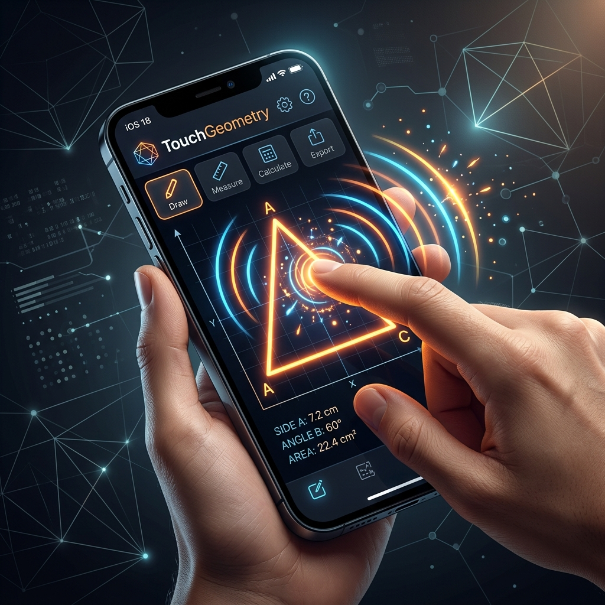
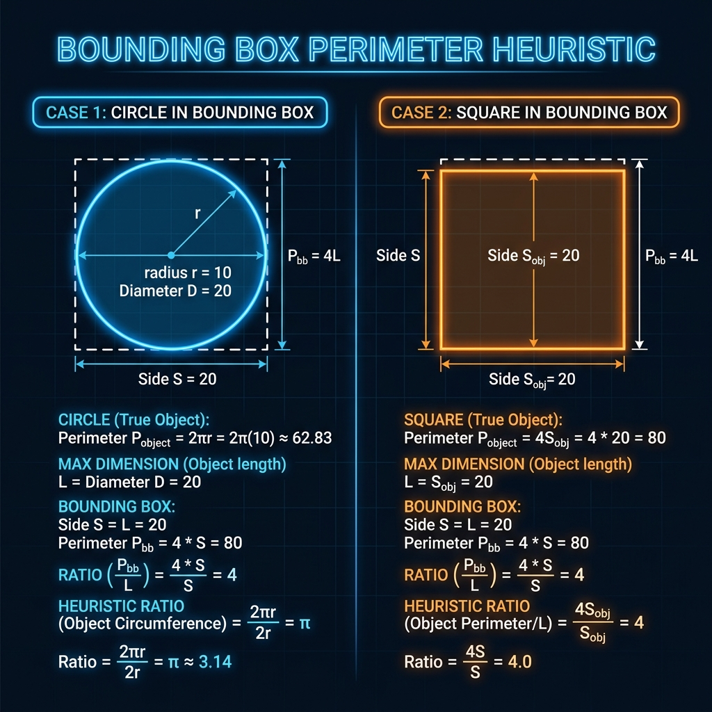
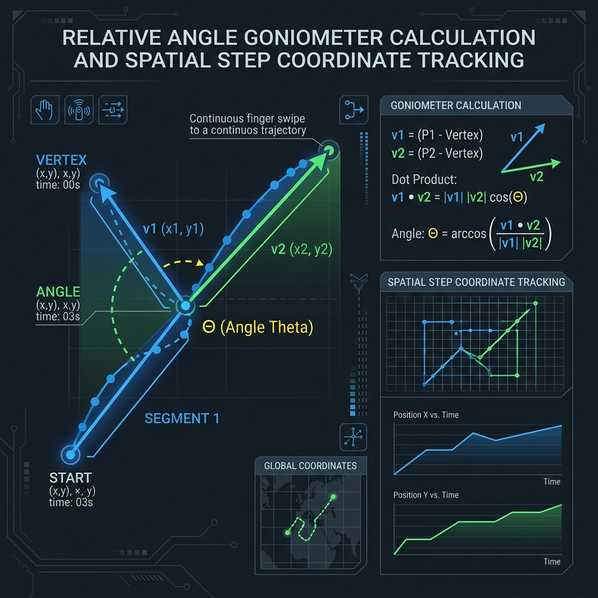

# TouchGeometry+ 📱📐

TouchGeometry+ is an interactive, multisensory geometry learning mobile application designed to empower visually impaired and young students. By shifting away from standard visual-only interfaces, the application translates geometry concepts into tactile vibration patterns, synthetic speech guidance, and physical locomotion using standard mobile device hardware.

---

## 🎨 System Overview & Experience

TouchGeometry+ is built with high-fidelity, high-contrast aesthetics and accessibility-first controls. 



---

## 🏗️ Architecture: The Client-Only "Frontend & Local Backend" Model

A primary design decision of TouchGeometry+ is its **Client-Only Architecture**. There is no remote online backend server or external API database. 

Instead, the system is separated into a **Visual-Touch Frontend** and a **Local Device-Engine Backend**:

### 1. The Frontend (Interaction & Navigation Layer)
* **Accessibility Shell**: Standard lists are replaced by a gesture-driven focus selector. Swiping horizontally anywhere on the screen ([HomeScreen.js](src/screens/HomeScreen.js#L44-L90)) changes the current focus element.
* **Double-Tap Selector**: To select an element, the user double-taps anywhere on the screen rather than pressing a small, precise button coordinates. This solves accessibility limitations of standard touch screens.
* **SVG Rendering**: High-contrast geometric outlines are rendered locally via `react-native-svg` to assist low-vision learners.

### 2. The "Local Backend" (Sensory & Hardware Engine Layer)
Because latency must remain ultra-low to match a user's tactile gestures, the "backend" logic is executed directly on the mobile phone using hardware APIs:
* **Haptics Engine ([HapticEngine.js](src/utils/HapticEngine.js))**: Acts as a tactile output driver. It converts touch movements and boundaries into light, medium, and heavy vibration pulses in real time.
* **Voice Speech Engine ([AudioEngine.js](src/utils/AudioEngine.js))**: Reads aloud curriculum steps, quiz items, and real-time coordinates.
* **IMU Spatial Sensor Engine ([LessonScreen.js](src/screens/LessonScreen.js#L41-L224))**: Actively tracks physical coordinates, acceleration peaks ($A_m > 1.3g$), and magnetometer rotations ($\Delta\theta$) to guide students through physical movement challenges.

---

## 📂 Project Directory Structure

```
touch-geometry-app/
├── .expo/                  # Expo internal build & session caching
├── assets/                 # App icons, splash screens, and technical diagrams
│   ├── touch_geometry_app.png
│   ├── geometry_heuristics.png
│   └── spatial_tracking.png
├── src/
│   ├── data/
│   │   └── curriculum.js   # Progressive learning paths & quiz questions
│   ├── screens/
│   │   ├── HomeScreen.js        # Double-tap, swipe-anywhere navigation shell
│   │   ├── LessonScreen.js      # Main sandbox and structured interactive lesson canvas
│   │   ├── QuizScreen.js        # Linear true/false and distance drawing quizzes
│   │   ├── SandboxScreen.js     # Free draw mode with real-time vector analysis
│   │   ├── SettingsScreen.js    # Tactile and auditory preference settings
│   │   └── GestureMenuScreen.js # Magic gesture-drawing menu classifier
│   └── utils/
│       ├── AudioEngine.js  # TTS synthesizer and sound player
│       ├── HapticEngine.js # Tactile pattern generators (dashed, sparkle, warnings)
│       └── GlobalStore.js  # Pub/Sub reactive progression store
├── App.js                  # Main navigation routes (Stack Router)
├── app.json                # Expo build configuration metadata
├── index.js                # App entrypoint hook
└── package.json            # Dependencies and terminal run scripts
```

---

## 🧮 Sophisticated Mathematical & Sensor Engines

### 1. Bounding Box Perimeter Heuristic (Magic Gesture Classifier)
The `GestureMenuScreen` dynamically classifies whether a single continuous gesture is a **Line**, a **Circle**, or a **Square** based on the bounding box dimension ratio ($R_{\text{shape}} = \frac{D}{W+H}$):



* **Line**: $R_{\text{shape}} < 1.3$. The trace distance is close to the bounding box dimension.
* **Circle**: $1.3 \le R_{\text{shape}} < 1.7$. A perfect circle mathematically yields a ratio of $\frac{\pi}{2} \approx 1.57$.
* **Square**: $R_{\text{shape}} \ge 1.7$. A perfect square mathematically yields a ratio of $2.0$.

---

### 2. Goniometer (Angle Measurement) & Corner Tracker
For free drawing analysis, the app uses localized vector maths to measure corners:



* **Vertex Search**: The vertex of a swipe is located by finding the coordinate that has the maximum perpendicular distance to the straight line segment between the start and end touch coordinates ([LessonScreen.js](src/screens/LessonScreen.js#L855-L864)).
* **Cosine Angle Derivation**: It computes vectors $\vec{u}$ and $\vec{v}$ branching from the vertex and solves for $\theta$ via the dot product:
  $$\cos(\theta) = \frac{\vec{u} \cdot \vec{v}}{\|\vec{u}\| \|\vec{v}\|} \implies \theta = \arccos\left(\cos(\theta)\right)$$
* **Acute/Right/Obtuse Classification**: Maps internal degrees directly to corresponding tactile warnings or success cues ([LessonScreen.js](src/screens/LessonScreen.js#L898-L901)).

---

### 3. Spatial IMU Sensor Fusion Pedometer
During the "Geometry Master" level, the phone becomes a compass and steps tracker:
* **Accelerometer Pedometer**: Sampling at $10\text{Hz}$ ([LessonScreen.js](src/screens/LessonScreen.js#L49)), it calculates acceleration magnitude $A_m = \sqrt{a_x^2 + a_y^2 + a_z^2}$. When $A_m > 1.3g$, a step is registered (with a $500\text{ms}$ debounce window to eliminate body sway).
* **Magnetometer Turning Engine**: geomagnetic fields $m_x, m_y$ are mapped into degrees ($\theta = \text{atan2}(m_y, m_x) \times \frac{180}{\pi}$). Users are prompted to pivot (e.g., $90^\circ$ for a square, $120^\circ$ for a triangle), verifying turns within a small $20^\circ$ error tolerance window.

---

## 🚀 Getting Started

### Prerequisites
Make sure you have Node.js (v18+) and npm installed.

### Installation
1. Clone the repository and navigate to the project directory:
   ```bash
   cd TouchGeometry-App
   ```
2. Install dependencies:
   ```bash
   npm install
   ```

### Running Locally
To launch the Expo bundle and preview the application, execute any of the following terminal commands:

* **Start development server** (with tunnel option for remote mobile debugging):
  ```bash
  npm run start
  ```
  *(Press `a` to open in Android Emulator, `i` to open in iOS Simulator, or scan the QR code using the Expo Go app on your phone)*

* **Run on Android Emulator**:
  ```bash
  npm run android
  ```

* **Run on iOS Simulator**:
  ```bash
  npm run ios
  ```

* **Run in Web Browser**:
  ```bash
  npm run web
  ```

---

## 🎛️ Key Engine Calibrations

| Metric Parameter | Value | System Function | Code Reference |
| :--- | :--- | :--- | :--- |
| `UNIT_PIXELS` | $60\text{ pixels}$ | Scale step conversion | [LessonScreen.js](src/screens/LessonScreen.js#L10) |
| `Speech Rate` | $0.85$ | Slower Voice TTS pace | [AudioEngine.js](src/utils/AudioEngine.js#L8) |
| `Jump $g$-Force` | $2.2g$ | Stamping coordinates | [LessonScreen.js](src/screens/LessonScreen.js#L62) |
| `Step $g$-Force` | $1.3g$ | Physical walk pacing | [LessonScreen.js](src/screens/LessonScreen.js#L164) |
| `Pedometer Interval` | $100\text{ms}$ | High-speed IMU sampling | [LessonScreen.js](src/screens/LessonScreen.js#L49) |
| `Compass Margin` | $20^\circ$ | Turning pivot tolerance | [LessonScreen.js](src/screens/LessonScreen.js#L202) |
| `Closed Loop Ratio` | $0.2$ | Shape closed-ends margin | [SandboxScreen.js](src/screens/SandboxScreen.js#L89) |
| `Double Tap Speed` | $500\text{ms}$ | Action verification delay | [HomeScreen.js](src/screens/HomeScreen.js#L77) |

---

## 🤝 Accessibility Principles Enforced
1. **Always Auditory**: Every interaction, swipe focus, success, error, and loading state is voiced in human-understandable guidance.
2. **Never Color-Reliant**: Shapes, corners, boundaries, and distances are presented via distinct vibration patterns rather than color labels.
3. **No Precise Target Areas**: Menu items and activities cover the entire screen container, allowing users with motor or visual deficits to interact by swiping and double-tapping anywhere.
