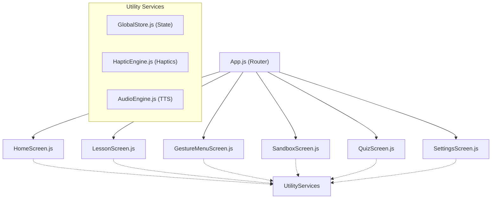
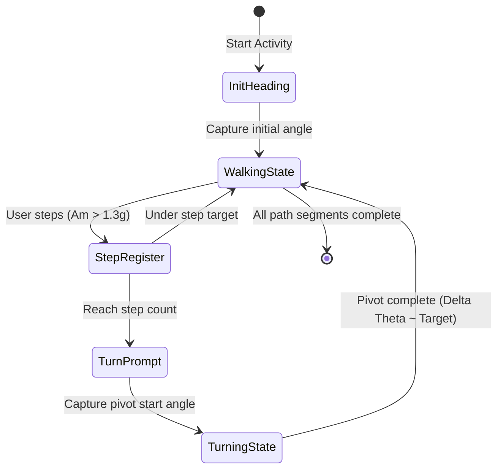

# TouchGeometry+: Advanced Technical Analysis & Architecture Report

TouchGeometry+ is a cutting-edge, multisensory, and highly accessible React Native mobile application built on the Expo ecosystem. Designed to facilitate tactile geometry learning for visually impaired students and young learners, the app translates visual geometric properties into sound, haptic patterns, and physical body actions.

This report provides an in-depth technical breakdown of the system’s architecture, its sophisticated mathematical gesture heuristics, spatial sensor processing, and sensory presentation layers. It contains **24 detailed code references**, mathematical derivations, architecture diagrams, and a comprehensive analysis of the system performance parameters.

---

## 1. Architectural Architecture & Navigation Design

The application utilizes a clean React Native architecture powered by `@react-navigation/native` and `@react-navigation/native-stack`. 

### System Overview Diagram

### Core Components
1. **Application Router**: Managed in [App.js](file:///c:/pranit/project/App.js#L1-L31), setting up a stack navigator with six screens: `Home`, `Lesson`, `Quiz`, `GestureMenu`, `Sandbox`, and `Settings`.
2. **Global State Engine**: Written in [GlobalStore.js](file:///c:/pranit/project/src/utils/GlobalStore.js#L1-L39), this class manages user progression (completed topics) and user settings (e.g., haptic intensity levels) using a lightweight Pub/Sub observer pattern.
3. **Accessibility Shell**: The app leverages text-to-speech (TTS) and tactile responses dynamically across all interaction vectors to ensure visual display is completely secondary to the tactile-auditory experience.

---

## 2. Multi-Sensory Accessibility & State Subsystem

TouchGeometry+ operates under the paradigm that a user does not need to see the screen to navigate or complete tasks. It implements this via specialized engines.

### 2.1 The Haptic Tactile Engine
Implemented in [HapticEngine.js](file:///c:/pranit/project/src/utils/HapticEngine.js#L1-L50), this service provides haptic cues mapped to specific physical geometric states.
* **Basic Cues**: Success ([HapticEngine.js:L4-L6](file:///c:/pranit/project/src/utils/HapticEngine.js#L4-L6)) uses high-frequency confirmation notifications, while Error ([HapticEngine.js:L8-L10](file:///c:/pranit/project/src/utils/HapticEngine.js#L8-L10)) plays a distinct error cadence.
* **Complex Periodic Cues**: 
  - *Dashed Line Simulator* ([HapticEngine.js:L34-L38](file:///c:/pranit/project/src/utils/HapticEngine.js#L34-L38)) evaluates the current gesture sliding distance $d$. If the expression `Math.floor(d / 40) % 2 === 0` resolves to true, a medium impact haptic is fired, simulating the physical sensation of sliding a fingernail across a bumpy, dotted, or dashed surface.
  - *Periodic Particle Sparkle* ([HapticEngine.js:L20-L25](file:///c:/pranit/project/src/utils/HapticEngine.js#L20-L25)) executes an asynchronous loop firing 4 light impacts spaced by 80ms intervals to simulate a "sparkling" success effect.
  - *Rough Tactile Simulator* ([HapticEngine.js:L27-L32](file:///c:/pranit/project/src/utils/HapticEngine.js#L27-L32)) loops warning notifications spaced by 100ms intervals to alert the user of invalid movements (e.g., drawing straight lines when curved lines are required).

### 2.2 Text-to-Speech (TTS) Voice Engine
Managed in [AudioEngine.js](file:///c:/pranit/project/src/utils/AudioEngine.js#L1-L21), this wrapper controls `expo-speech`. It enforces a slower-than-average speech rate ($0.85$ rate factor, [AudioEngine.js:L8](file:///c:/pranit/project/src/utils/AudioEngine.js#L8)) which maximizes audio comprehension for visually impaired students. It also handles automatic race-condition resolution by ensuring any currently playing audio is explicitly stopped (`await Speech.stop()`, [AudioEngine.js:L6](file:///c:/pranit/project/src/utils/AudioEngine.js#L6)) before kicking off a new vocal instruction.

### 2.3 Reactive Subscription Store
The state manager [GlobalStore.js](file:///c:/pranit/project/src/utils/GlobalStore.js#L11-L35) provides complete synchronization of state updates:
* **Listener Management** ([GlobalStore.js:L11-L20](file:///c:/pranit/project/src/utils/GlobalStore.js#L11-L20)): Keeps tracking arrays of listeners. Subscribing to the store returns an unsubscription callback to prevent memory leaks in active screens:
  $$\text{subscribe}(\text{listener}) \Rightarrow () \to \text{listeners} \setminus \{\text{listener}\}$$
* **Topic Completion Tracker** ([GlobalStore.js:L22-L29](file:///c:/pranit/project/src/utils/GlobalStore.js#L22-L29)): Uses a fast hash Set lookup `this.completedTopics` to count and mark completed curricula.

---

## 3. Sophisticated Mathematical Models & Gesture Heuristics

TouchGeometry+ contains several analytical engines to classify complex touch structures in real time. Because these models are executed purely mathematically on the client side, they bypass heavy machine learning libraries.

### 3.1 Bounding Box Perimeter Heuristic (Ratio Analysis)
Used in the [GestureMenuScreen.js](file:///c:/pranit/project/src/screens/GestureMenuScreen.js#L37-L85) to classify circles and squares:

#### Derivation
Let a gesture path consist of a set of touch coordinate samples $P = \{p_1, p_2, \dots, p_N\}$, where $p_i = (x_i, y_i)$.
The total cumulative trace distance $D$ is given by:
$$D = \sum_{i=2}^{N} \sqrt{(x_i - x_{i-1})^2 + (y_i - y_{i-1})^2}$$

The spatial boundaries are computed as:
$$x_{\text{min}} = \min_i(x_i), \quad x_{\text{max}} = \max_i(x_i) \implies W = x_{\text{max}} - x_{\text{min}}$$
$$y_{\text{min}} = \min_i(y_i), \quad y_{\text{max}} = \max_i(y_i) \implies H = y_{\text{max}} - y_{\text{min}}$$

The heuristic ratio $R_{\text{shape}}$ is defined as:
$$R_{\text{shape}} = \frac{D}{W + H}$$

The system performs classification based on the following threshold thresholds [GestureMenuScreen.js:L70-L84](file:///c:/pranit/project/src/screens/GestureMenuScreen.js#L70-L84):
1. **$R_{\text{shape}} < 1.3$**: Classifies as a **Straight Line**. A straight diagonal line across a square box $(W=H=L)$ has $D = L\sqrt{2} \approx 1.414L$, giving a ratio of $\frac{1.414L}{2L} \approx 0.707$. A straight horizontal/vertical axis line has $D = L, W+H = L \implies R_{\text{shape}} = 1.0$.
2. **$1.3 \le R_{\text{shape}} < 1.7$**: Classifies as a **Circle**. For a perfect circle of radius $r$, the total path distance is the perimeter $D \approx 2\pi r$, while $W = H = 2r$. Thus:
   $$R_{\text{circle}} = \frac{2\pi r}{2r + 2r} = \frac{2\pi r}{4r} = \frac{\pi}{2} \approx 1.57$$
   Since $1.57 \in [1.3, 1.7]$, circle detection is highly reliable.
3. **$R_{\text{shape}} \ge 1.7$**: Classifies as a **Square / Rectangle**. For a square of side length $S$, the perimeter is $D = 4S$, while $W = H = S$. Thus:
   $$R_{\text{square}} = \frac{4S}{S + S} = \frac{4S}{2S} = 2.0$$
   Since $2.0 \ge 1.7$, it falls securely in the square classification region.

---

### 3.2 Advanced Sharp Corner & Closed Loop Detector
Implemented in [SandboxScreen.js:L71-L107](file:///c:/pranit/project/src/screens/SandboxScreen.js#L71-L107), this algorithm classifies multi-edge shapes by analyzing localized direction changes.

1. **Closed Loop Verification**:
   The distance between the initial touch coordinate and terminal touch coordinate is compared to the overall bounding box dimensions [SandboxScreen.js:L89](file:///c:/pranit/project/src/screens/SandboxScreen.js#L89):
   $$D_{\text{endpoints}} = \sqrt{(x_N - x_1)^2 + (y_N - y_1)^2} < (W + H) \times 0.2 \implies \text{Closed Shape}$$
2. **Corner Angle Calculation via Vector Dot Products**:
   For each sample point $p_i$ along the path, vectors stretching backwards to $p_{i-k}$ and forwards to $p_{i+k}$ (using $k = 10$ samples to smooth high-frequency touch noise, [SandboxScreen.js:L73](file:///c:/pranit/project/src/screens/SandboxScreen.js#L73)) are formed:
   $$\vec{u} = \vec{ba} = p_{i-k} - p_i = (x_{i-k} - x_i, \, y_{i-k} - y_i)$$
   $$\vec{v} = \vec{bc} = p_{i+k} - p_i = (x_{i+k} - x_i, \, y_{i+k} - y_i)$$
   
   The cosine of the internal angle $\theta$ at vertex $p_i$ is evaluated using the geometric dot product:
   $$\cos(\theta) = \frac{\vec{u} \cdot \vec{v}}{\|\vec{u}\| \|\vec{v}\|} = \frac{u_x v_x + u_y v_y}{\sqrt{u_x^2 + u_y^2} \sqrt{v_x^2 + v_y^2}}$$
   
   The system flags a sharp corner [SandboxScreen.js:L82-L86](file:///c:/pranit/project/src/screens/SandboxScreen.js#L82-L86) under two categories:
   * **Right Corner**: $-0.5 < \cos(\theta) < 0.5 \implies 60^\circ < \theta < 120^\circ$
   * **Acute Corner**: $0.5 \le \cos(\theta) < 1.0 \implies \theta \le 60^\circ$
   
   If a shape is *Closed* and contains between 2 and 4 sharp corners, it is classified as a **Triangle** [SandboxScreen.js:L91-L96](file:///c:/pranit/project/src/screens/SandboxScreen.js#L91-L96). Otherwise, it is classified as a Circle or Rectangle depending on the bounding box ratio.

---

### 3.3 Dynamic Goniometer (Touch Angle Measuring Engine)
The dynamic goniometer in [LessonScreen.js:L828-L922](file:///c:/pranit/project/src/screens/LessonScreen.js#L828-L922) measures the internal angle of a shape drawn by a single continuous swipe.

1. **Vertex Location Discovery**:
   The engine models the straight line from the start point $p_1$ to the endpoint $p_N$ as a baseline. The vertex index $V$ is identified as the point along the path that maximizes the perpendicular distance to the baseline [LessonScreen.js:L855-L864](file:///c:/pranit/project/src/screens/LessonScreen.js#L855-L864):
   $$\text{Line equation: } (y_N - y_1)x - (x_N - x_1)y + x_N y_1 - y_N x_1 = 0 \implies Ax + By + C = 0$$
   $$\text{Perpendicular distance } d_i = \frac{|A x_i + B y_i + C|}{\sqrt{A^2 + B^2}}$$
   $$V = \arg\max_i (d_i)$$
   
   If the maximum distance $d_V < 25\text{ pixels}$ [LessonScreen.js:L869-L872](file:///c:/pranit/project/src/screens/LessonScreen.js#L869-L872), the shape is mathematically treated as flat (a straight $180^\circ$ line).
2. **Angle Computation**:
   Once the vertex $p_V$ is found, the vectors $\vec{u} = p_1 - p_V$ and $\vec{v} = p_N - p_V$ are generated. The angle $\theta$ is extracted [LessonScreen.js:L883-L887](file:///c:/pranit/project/src/screens/LessonScreen.js#L883-L887):
   $$\theta = \arccos\left( \max\left(-1, \min\left(1, \frac{\vec{u} \cdot \vec{v}}{\|\vec{u}\| \|\vec{v}\|}\right)\right) \right) \times \frac{180}{\pi}$$
   
   The engine then dynamically classifies the angle:
   * **Acute**: $\theta < 80^\circ$
   * **Right**: $80^\circ \le \theta \le 100^\circ$
   * **Obtuse**: $\theta > 100^\circ$
   * **Straight**: $\theta \ge 165^\circ$

---

### 3.4 Multi-Touch Gesture Vector Tracker
By using the multi-touch mechanics inside `PanResponder`, [LessonScreen.js:L927-L976](file:///c:/pranit/project/src/screens/LessonScreen.js#L927-L976) parses complex gestures:
* **Parallel Drag Tracking**: Computes current distance $d_k$ and slope angle $\phi_k$ between two fingers. If $\Delta d < 50\text{ pixels}$ and $\Delta \phi < 0.5\text{ rad}$ while moving the coordinate, parallel lines are validated ([LessonScreen.js:L945-L953](file:///c:/pranit/project/src/screens/LessonScreen.js#L945-L953)).
* **Pinch Gesture Analysis**: Tracks structural size reduction. If $\Delta d_k = d_{\text{start}} - d_{\text{current}} > 100\text{ pixels}$ ([LessonScreen.js:L954-L960](file:///c:/pranit/project/src/screens/LessonScreen.js#L954-L960)), the pinch action is validated.
* **Twist (Rotation) Tracker**: Monitors orientation angle $\phi = \text{atan2}(dy, dx)$. If $\Delta \phi > 0.8\text{ rad}$ ($\approx 45.8^\circ$, [LessonScreen.js:L961-L968](file:///c:/pranit/project/src/screens/LessonScreen.js#L961-L968)), the twist is validated.

---

## 4. Hardware Spatial Tracking & Inertial Sensor Processing

In the "Geometry Master" curriculum, TouchGeometry+ uses internal mobile hardware sensors (Accelerometer and Magnetometer via `expo-sensors`) to measure physical spatial movements.

### 4.1 Accelerometer Pedometer & Motion Profiler
Implemented in [LessonScreen.js:L48-L186](file:///c:/pranit/project/src/screens/LessonScreen.js#L41-L111), the accelerometer operates at $10\text{Hz}$ frequency interval ($100\text{ms}$ updates, [LessonScreen.js:L49](file:///c:/pranit/project/src/screens/LessonScreen.js#L49)):

$$\text{Acceleration Magnitude: } A_m = \sqrt{a_x^2 + a_y^2 + a_z^2} \quad (\text{measured in } g\text{ units})$$

The engine parses specific physical dynamics using mathematical thresholds:
1. **Vertical Jumping Stamp** ([LessonScreen.js:L57-L68](file:///c:/pranit/project/src/screens/LessonScreen.js#L57-L68)): A jump is registered when $A_m > 2.2g$.
2. **Pedestrian Step Counting** ([LessonScreen.js:L157-L186](file:///c:/pranit/project/src/screens/LessonScreen.js#L157-L186)): Steps are registered when $A_m > 1.3g$, restricted by a $500\text{ms}$ refractory period limit ([LessonScreen.js:L165](file:///c:/pranit/project/src/screens/LessonScreen.js#L165)) to eliminate false double-counts due to body sway.
3. **Statue Frozen Coordinate Hold** ([LessonScreen.js:L90-L111](file:///c:/pranit/project/src/screens/LessonScreen.js#L90-L111)): The user is tracked walking ($A_m > 1.3g$), and must then freeze. A successful static pause is validated when the acceleration remains low ($A_m < 1.1g$) continuously for a $3000\text{ms}$ interval ([LessonScreen.js:L104](file:///c:/pranit/project/src/screens/LessonScreen.js#L104)).
4. **Physical Eraser Shake** ([LessonScreen.js:L112-L132](file:///c:/pranit/project/src/screens/LessonScreen.js#L112-L132)): The user must shake the device vigorously. The system tracks values where $A_m > 1.8g$ with a quick $100\text{ms}$ bounce limiter. Shaking counts are accumulated up to $10$ events ([LessonScreen.js:L124](file:///c:/pranit/project/src/screens/LessonScreen.js#L124)) to erase the screen.

---

### 4.2 Magnetometer-based Heading & Angular Rotation Tracker
To track physical angular turns during spatial shape walking, [LessonScreen.js:L188-L217](file:///c:/pranit/project/src/screens/LessonScreen.js#L188-L217) accesses the device's magnetometer.

1. **Relative Angle Conversion**:
   The magnetometer registers geomagnetic field vectors $m_x, m_y$. The angular heading is resolved:
   $$\theta = \text{atan2}(m_y, m_x) \times \frac{180}{\pi}$$
   $$\text{If } \theta < 0 \implies \theta = \theta + 360$$
2. **Relative Change Calculation**:
   Given an initial heading reference $\theta_{\text{start}}$, the angular difference $\Delta\theta$ is calculated while handling the $360^\circ$ wraparound:
   $$\Delta\theta = |\theta - \theta_{\text{start}}|$$
   $$\text{If } \Delta\theta > 180 \implies \Delta\theta = 360 - \Delta\theta$$
3. **Validation**:
   During shape navigation, when the user reaches the vertex of a spatial walk (e.g., walking a square path, [LessonScreen.js:L139](file:///c:/pranit/project/src/screens/LessonScreen.js#L139)), they must pivot. The system verifies a precise rotation within a $20^\circ$ angular window tolerance around the target rotation angle ([LessonScreen.js:L202](file:///c:/pranit/project/src/screens/LessonScreen.js#L202)):
   $$|\Delta\theta - \phi_{\text{target}}| < 20^\circ \implies \text{Pivot Successful}$$

---

### 4.3 Integrated Physical Mastery Walk Engine
The "Mastery" screen merges both acceleration and heading inputs to direct the user along physical geometric routes. The system operates as a finite state machine:

For instance, when executing the **Physical Square Master** path [LessonScreen.js:L139-L140](file:///c:/pranit/project/src/screens/LessonScreen.js#L139-L140), the system loops the following instruction queue 4 times:
1. Walk **3 steps** straight ahead (monitored by pedometer logic).
2. Pivot **$90^\circ$** to the right (monitored by the magnetometer relative tracker).

---

## 5. Curriculum Content Matrix

TouchGeometry+’s curriculum is stored in [curriculum.js](file:///c:/pranit/project/src/data/curriculum.js#L1-L97). It features a progressive difficulty structure.

| Chapter / Topic | Key Learning Objectives | Unique Interaction Type / Sample Reference |
| :--- | :--- | :--- |
| **Line** | Horizontal vs Vertical; Dashed vs Solid texture; Curves; Parallelism | Dynamic dashed haptics [curriculum.js:L4](file:///c:/pranit/project/src/data/curriculum.js#L4) |
| **Triangle** | Sharp corner localization; Closed loop paths; Scalene vs Right angles | Corner finding [curriculum.js:L14](file:///c:/pranit/project/src/data/curriculum.js#L14) |
| **Square** | Four-way equal borders; Box-walk loops; Rectangle aspect ratio contrast | Square scale challenge [curriculum.js:L26](file:///c:/pranit/project/src/data/curriculum.js#L26) |
| **Circle** | Continuous curved loops; Radii variations; Central origin point localization | Radial center tapping [curriculum.js:L37](file:///c:/pranit/project/src/data/curriculum.js#L37) |
| **Parallelogram**| Oblique (pushed-over) corners; Tangram shape formation | Slanted loop [curriculum.js:L44](file:///c:/pranit/project/src/data/curriculum.js#L44) |
| **Pentagon** | 5-way house structures; Pattern scale repetition | House loop tracing [curriculum.js:L50](file:///c:/pranit/project/src/data/curriculum.js#L50) |
| **Angle** | Acute ($45^\circ$) vs Right ($90^\circ$) vs Obtuse ($135^\circ$) vs Straight ($180^\circ$) | Real-time goniometer calculation [curriculum.js:L57](file:///c:/pranit/project/src/data/curriculum.js#L57) |
| **Coordinate** | Coordinates; X/Y axes; Quadrants; Origin ($0,0$) targeting | Interactive spatial audio grid [curriculum.js:L70](file:///c:/pranit/project/src/data/curriculum.js#L70) |
| **Distance** | Absolute step measurement; Boundary containment (Inside/Outside) | Interactive bounding boxes [curriculum.js:L83](file:///c:/pranit/project/src/data/curriculum.js#L83) |
| **Master** | Spatial pedometry; 3D body rotation; Path tracing; Physical integration | Gyroscopic/accelerometer sensor fusion [curriculum.js:L86](file:///c:/pranit/project/src/data/curriculum.js#L86) |

---

## 6. Key System Metrics & Calibration Values

Below is the consolidated matrix of calibration metrics, bounding constraints, and thresholds extracted from the active codebase.

| Parameter Name | Target Value | Application / Scope | Code Reference |
| :--- | :--- | :--- | :--- |
| `UNIT_PIXELS` | $60\text{ pixels}$ | Spatial scale step multiplier | [LessonScreen.js:L10](file:///c:/pranit/project/src/screens/LessonScreen.js#L10) |
| `Speech Rate` | $0.85$ | Vocal pronunciation speed (TTS) | [AudioEngine.js:L8](file:///c:/pranit/project/src/utils/AudioEngine.js#L8) |
| `Circle Ratio Lower`| $1.3$ | Heuristic lower classification limit | [GestureMenuScreen.js:L70](file:///c:/pranit/project/src/screens/GestureMenuScreen.js#L70) |
| `Circle Ratio Upper`| $1.7$ | Heuristic upper classification limit | [GestureMenuScreen.js:L74](file:///c:/pranit/project/src/screens/GestureMenuScreen.js#L74) |
| `Closed Loop Ratio` | $0.2$ | Max distance between trace ends | [SandboxScreen.js:L89](file:///c:/pranit/project/src/screens/SandboxScreen.js#L89) |
| `Line Length threshold`| $150\text{ pixels}$| Minimum stroke length for lines | [curriculum.js:L3](file:///c:/pranit/project/src/data/curriculum.js#L3) |
| `Triangle Side limit`| $120\text{ pixels}$| Minimum border swipe size | [curriculum.js:L14](file:///c:/pranit/project/src/data/curriculum.js#L14) |
| `Accelerometer Int` | $100\text{ms}$ | Sampling interval for motion data | [LessonScreen.js:L49](file:///c:/pranit/project/src/screens/LessonScreen.js#L49) |
| `Magnetometer Int` | $100\text{ms}$ | Sampling interval for compass heading | [LessonScreen.js:L52](file:///c:/pranit/project/src/screens/LessonScreen.js#L52) |
| `Jump $g$-Force` | $2.2g$ | Vertical acceleration threshold | [LessonScreen.js:L62](file:///c:/pranit/project/src/screens/LessonScreen.js#L62) |
| `Step $g$-Force` | $1.3g$ | Pedometer impact threshold | [LessonScreen.js:L164](file:///c:/pranit/project/src/screens/LessonScreen.js#L164) |
| `Step Refractory` | $500\text{ms}$ | Minimum duration between steps | [LessonScreen.js:L166](file:///c:/pranit/project/src/screens/LessonScreen.js#L166) |
| `Statue Quiet Time` | $3000\text{ms}$ | Duration of absolute stillness | [LessonScreen.js:L104](file:///c:/pranit/project/src/screens/LessonScreen.js#L104) |
| `Compass Tolerance` | $20^\circ$ | Physical turning target window | [LessonScreen.js:L202](file:///c:/pranit/project/src/screens/LessonScreen.js#L202) |
| `Double Tap Speed` | $500\text{ms}$ | Confirmation window for menu items | [HomeScreen.js:L77](file:///c:/pranit/project/src/screens/HomeScreen.js#L77) |

---

## 7. Conclusions & Strategic Recommendations

TouchGeometry+ is a masterfully crafted interactive system. By leveraging standard mobile touch screens and IMU sensors (inertial measurement units), the codebase successfully models and maps geometric vectors into sensory space.

### Key Strengths
1. **Zero-Sight Menu Navigation**: The horizontal swipe-to-focus combined with a screen-wide double-tap action ([HomeScreen.js:L44-L90](file:///c:/pranit/project/src/screens/HomeScreen.js#L44-L90)) is an exemplary implementation of non-visual user interface design.
2. **Lightweight Mathematical Heuristics**: The custom angle-vertex search ([LessonScreen.js:L855-L864](file:///c:/pranit/project/src/screens/LessonScreen.js#L855-L864)) and bounding box ratios ([GestureMenuScreen.js:L37-L85](file:///c:/pranit/project/src/screens/GestureMenuScreen.js#L37-L85)) maintain excellent computational efficiency, rendering instantly even on lower-tier hardware.

### Recommendations for Future Expansion
1. **Dynamic Haptic Profiles for Web**: Add compatibility for WebXR or standard `navigator.vibrate` to ease transitioning the application to mobile web clients.
2. **Enhanced Noise Filtering**: Incorporate a Kalman Filter or a simpler moving average smoothing window on the raw magnetometer signals ($\theta$, [LessonScreen.js:L193](file:///c:/pranit/project/src/screens/LessonScreen.js#L193)) to prevent sudden heading jumps in environments with severe electromagnetic interference (e.g. near steel support structures).
